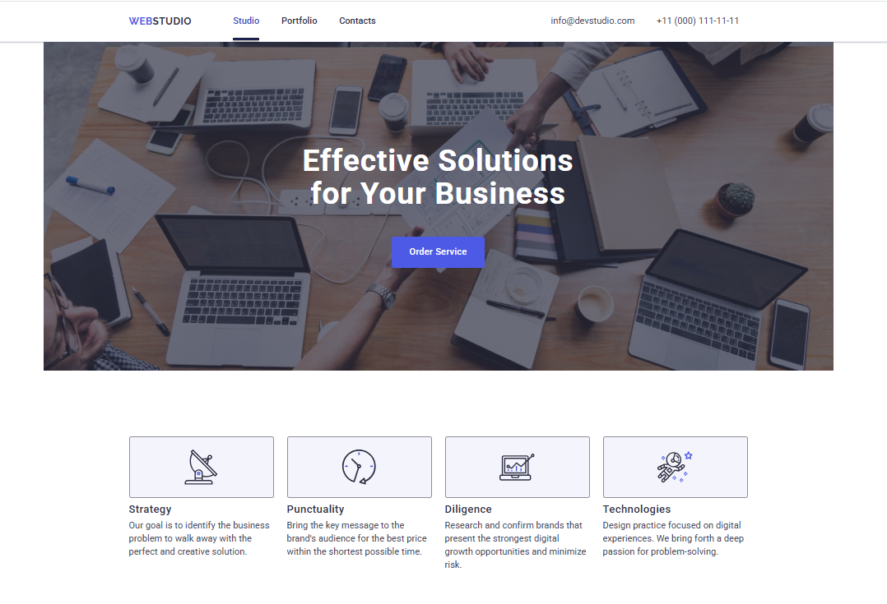
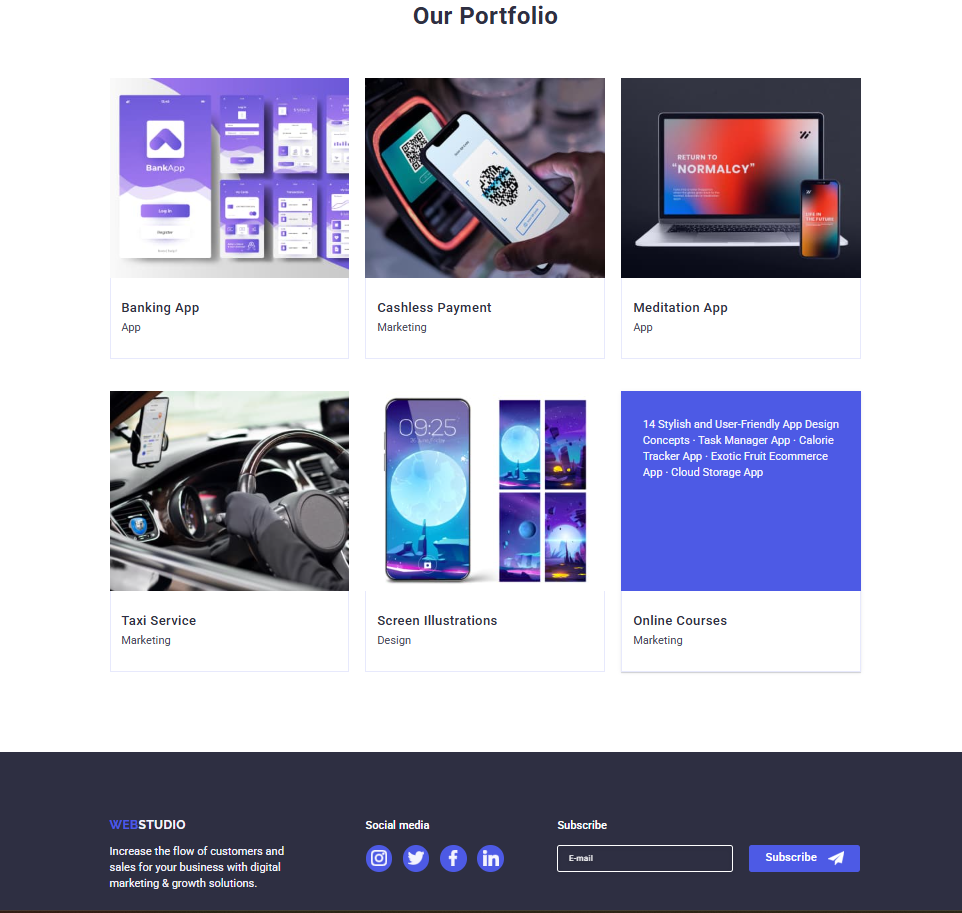

# 🎨 WebStudio — Layout, Animation & Responsive Practice

### _HTML + CSS project focusing on layout, animations, modal interactions and responsive design._

---

### 🔗 **Live Demo**

https://hannaassaf.github.io/goit-markup-hw-06/

---

## 📌 Overview

This project demonstrates essential front-end skills such as page layout, flexbox, responsive design, transitions, animations, and interactive modal windows.  
It is a compact practice project completed as part of my web development learning path.

---

## 🖼️ Preview

---

## ✨ Key Features

- Responsive, mobile-friendly layout  
- Smooth hover transitions  
- Modal window with open/close animation  
- Backdrop overlay effect  
- Flexbox-based sections and clean structure  

---

## 🛠 Tech Stack

- **HTML5**  
- **CSS3**  
- **Flexbox / Positioning**  
- **Basic animations & transitions**  
- **Responsive Web Design**  

---

🧡 *Learning by doing — one project at a time.*

